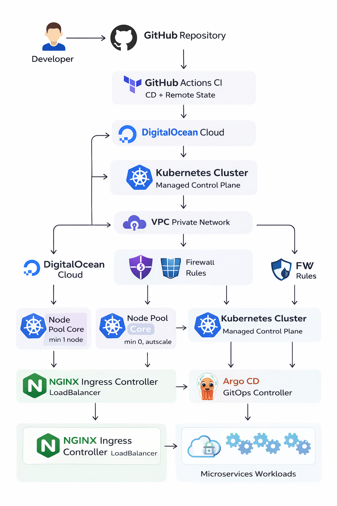

# 🚀 Production‑Grade Kubernetes Platform on DigitalOcean

This repository documents my **end‑to‑end Kubernetes production platform** built on **DigitalOcean**, fully provisioned using **Terraform**, and bootstrapped with **Argo CD** and **NGINX Ingress Controller**.

The goal of this project is to demonstrate how I design, provision, and operate a **real‑world, production‑grade Kubernetes environment** — starting from **zero infrastructure** to a **GitOps‑ready production cluster**, while keeping it **small‑scale friendly** and **auto‑scalable for growth**.

This README is written as a **sudo-coder, hands‑on portfolio walkthrough**, not just tool documentation.

---

## 🧠 Why This Project Exists

In real companies, Kubernetes is not just about creating a cluster.
It’s about:
- repeatability
- automation
- scalability
- security
- clean separation of concerns
- GitOps‑driven operations

This project reflects how I would build a **production platform** for:
- startups
- internal enterprise platforms
- microservice‑based systems

---

## 🧩 High‑Level Architecture

<p align="center">
  
</p>

<p align="center">
  <em>High-Level Design (HLD): Terraform-driven infrastructure, GitOps with Argo CD, and production-grade Kubernetes on DigitalOcean</em>
</p>

Key principles:
- **Infrastructure as Code (IaC)**
- **GitOps first**
- **Minimal initial cost**
- **Auto‑scaling ready**

---

## 🛠️ Technology Stack

| Layer | Tool |
|-----|-----|
| Cloud | DigitalOcean |
| IaC | Terraform |
| Container Orchestration | Kubernetes |
| GitOps | Argo CD |
| Ingress / Load Balancer | NGINX Ingress |
| CI | GitHub Actions |
| Helm | Helm Provider (Terraform) |

---

## 📁 Repository Structure

```
.github/
 └── workflows/
     └── terraform-ci.yml      # Terraform CI pipeline

terraform/
 ├── argocd/                   # Argo CD bootstrap via Terraform
 │   ├── helm.tf
 │   ├── ingress.tf
 │   ├── namespace.tf
 │   ├── outputs.tf
 │   ├── values.yaml
 │   └── variables.tf

 ├── ingress-nginx/            # NGINX Ingress Controller
 │   ├── helm.tf
 │   └── namespace.tf

 ├── backend.tf                # Remote Terraform backend
 ├── cluster.tf                # DigitalOcean Kubernetes cluster
 ├── database.tf               # Managed DB (optional / extensible)
 ├── firewall.tf               # Network security rules
 ├── nodepool.tf               # Node pools & auto-scaling
 ├── platform.tf               # Platform-level resources
 ├── project.tf                # DO project binding
 ├── providers.tf              # Providers configuration
 ├── variables.tf              # Input variables
 ├── versions.tf               # Provider & Terraform versions
 └── vpc.tf                    # Private networking
```

---

## 🧱 Step‑by‑Step: From Scratch to Production

### 1️⃣ Cloud Foundation (Terraform)

I start with **pure infrastructure** — no Kubernetes yet.

Provisioned components:
- DigitalOcean Project
- VPC (isolated private network)
- Firewall rules (cluster‑only access)
- Remote Terraform backend (state safety)

This ensures:
- clean network boundaries
- reproducible environments
- safe collaboration

---

### 2️⃣ Kubernetes Cluster (Production‑Ready)

The Kubernetes cluster is created using **Terraform DO Kubernetes provider**.

Key design decisions:
- **Small initial node pool** for cost efficiency
- **Cluster autoscaler enabled**
- Control plane managed by DigitalOcean

This allows:
- start small
- scale safely
- avoid over‑provisioning

---

### 3️⃣ Node Pools & Auto‑Scaling Strategy

I designed **two scaling phases**:

#### 🔹 Phase 1: Initial / Small Scale
- Minimum nodes: `1`
- Suitable for:
  - platform setup
  - Argo CD
  - core services

#### 🔹 Phase 2: Medium Scale (Zero‑Node Ready)
- Minimum nodes: `0`
- Maximum nodes defined
- Nodes scale **only when workloads arrive**

This approach is:
- cost‑optimized
- production‑safe
- perfect for microservices

---

### 4️⃣ NGINX Ingress Controller (Terraform‑Managed)

Ingress is deployed using **Helm via Terraform**.

Why Terraform instead of kubectl?
- version control
- repeatable installs
- environment consistency

Ingress features:
- External LoadBalancer
- Production‑grade defaults
- Ready for TLS / cert‑manager

---

### 5️⃣ Argo CD Bootstrap (Before GitOps Pipelines)

This is the **most important design choice**.

Instead of manually installing Argo CD, I:
- deploy Argo CD using Terraform
- configure namespaces, services, ingress
- expose Argo CD securely

This creates a **GitOps control plane first**.

Once Argo CD is live:
- Terraform stops managing applications
- Argo CD takes over

---

### 6️⃣ Transition to GitOps (Argo CD Pipelines)

After bootstrap:
- application manifests live in Git
- Argo CD continuously syncs desired state
- microservices are deployed declaratively

This separation ensures:
- Terraform = infrastructure
- Argo CD = workloads

---

## 🔁 CI / CD Strategy (GitHub Actions + Terraform Cloud)

This project uses **GitHub as CI** and **Terraform Cloud as the remote backend and CD engine**.

### 🔹 Continuous Integration (CI) – GitHub Actions

GitHub Actions is responsible for **validation and planning**:
- `terraform fmt` – formatting check
- `terraform validate` – configuration validation
- `terraform plan` – safe preview of changes

This ensures every pull request:
- is syntactically correct
- follows Terraform best practices
- does not introduce unexpected changes

### 🔹 Continuous Deployment (CD) – Terraform Cloud

Terraform Cloud is used as:
- **remote backend** (secure state storage)
- **execution environment** for `apply`
- **single source of truth** for infrastructure state

Deployment flow:
1. Code pushed to GitHub
2. GitHub Actions runs CI checks
3. Terraform Cloud detects changes
4. Terraform Cloud executes `terraform apply`

This design:
- removes local state risks
- enables team collaboration
- provides audit logs and run history

Terraform Cloud acts as the **controlled CD layer**, while GitHub remains the **developer-facing CI entry point**.

---

## 🔐 Production‑Grade Practices Applied

- Infrastructure as Code
- GitOps‑first mindset
- Auto‑scaling node pools
- Private networking (VPC)
- Firewall‑restricted access
- Helm version pinning
- Environment separation readiness (dev / uat / prod)

---

## 📈 What This Platform Is Ready For

- Microservices (REST / gRPC)
- CI/CD pipelines
- Blue‑Green or Canary deployments
- Service mesh (future extension)
- Observability stack (Prometheus, Grafana)

---

## 🎯 Why This Matters

This project shows:
- real production thinking
- cloud cost awareness
- GitOps maturity
- Kubernetes beyond tutorials

It reflects how I would design and operate a **professional Kubernetes platform** in real organizations.

---

## 📬 Contact

If you want to discuss:
- Kubernetes architecture
- DevOps / Platform Engineering
- GitOps strategies

Feel free to reach out or explore the repo further.

---


